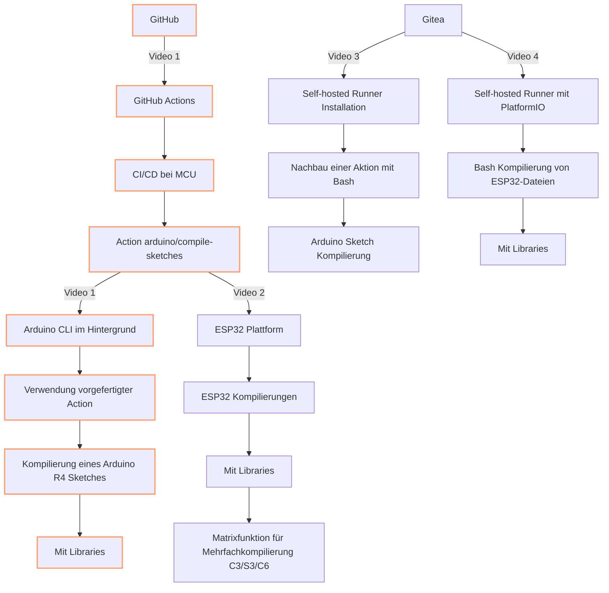

# GitHub Actions
Eine kurze Einführung mit Arduino und ESP32 Codes.  Wir verwenden dafür vordefinierte Aktionen, die das Kompilieren von Sketches ermöglichen und wie du deine CI/CD-Pipeline so einrichtest, 
dass deine Arduino- und ESP32-Codes automatisch überprüft werden

## Videos
Playlist: https://www.youtube.com/playlist?list=PLluslK6uBf4tOir-zkFXTTtdfZk6BK0MW

## Alle Repos zur Serie
- https://github.com/pixelEDI/GitHubAction_ArduinoR4
- https://github.com/pixelEDI/GitHubAction_ESP32XIAO
- https://github.com/pixelEDI/GiteaAction_ArduinoR4
- https://github.com/pixelEDI/GIiteaAciton_pio_ESP32XIAO

## übersicht

